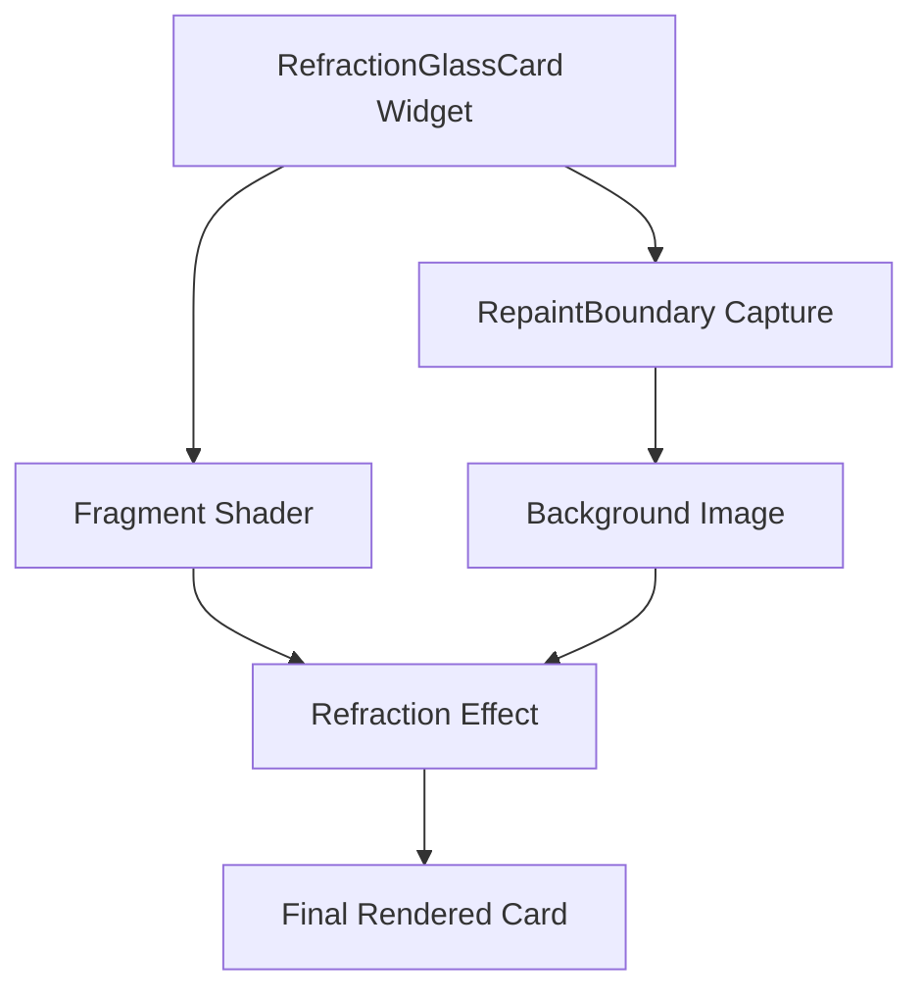

# Liquid Glass Effect Implementation

A custom iOS 26-style "liquid glass" refraction effect for Flutter, implemented using GLSL fragment shaders. This document explains the implementation details and how to use it in your own projects.

## Overview

The liquid glass effect creates a realistic glass-like distortion that:
- Shows the background content through a "glass" surface
- Applies lens-like refraction distortion
- Includes subtle wave animations
- Features Fresnel edge glow (brighter at edges like real glass)


## Architecture



## Key Components

### 1. Fragment Shader (`shaders/refraction_glass.frag`)

The GLSL shader handles the visual effect:

```glsl
#version 460 core
#include <flutter/runtime_effect.glsl>

uniform vec2 uSize;           // Widget size
uniform vec2 uScreenSize;     // Full screen size
uniform vec2 uWidgetPos;      // Widget position on screen
uniform sampler2D uTexture;   // Background capture
uniform float uRefraction;    // Distortion strength
uniform float uTime;          // Animation time

out vec4 fragColor;

void main() {
    vec2 fragCoord = FlutterFragCoord().xy;
    vec2 localUV = fragCoord / uSize;
    
    // Map to screen position
    vec2 screenPos = uWidgetPos + fragCoord;
    vec2 bgUV = vec2(screenPos.x / uScreenSize.x, 
                     1.0 - (screenPos.y / uScreenSize.y)); // Y flip
    
    // Lens distortion
    vec2 fromCenter = localUV - vec2(0.5);
    float dist = length(fromCenter);
    float wave = sin(atan(fromCenter.y, fromCenter.x) * 4.0 + uTime * 0.8) * 0.008;
    
    vec2 refractOffset = fromCenter * (smoothstep(0.0, 0.5, dist) * uRefraction + wave);
    vec4 bgColor = texture(uTexture, clamp(bgUV + refractOffset, 0.001, 0.999));
    
    // Fresnel edge glow
    float fresnel = pow(dist * 1.2, 2.0) * 0.1;
    vec3 finalColor = mix(bgColor.rgb, vec3(1.0), 0.05 + fresnel);
    
    fragColor = vec4(finalColor, 0.95);
}
```

### 2. Widget (`lib/core/widgets/refraction_glass_card.dart`)

The Flutter widget that orchestrates everything:

```dart
class RefractionGlassCard extends StatefulWidget {
  const RefractionGlassCard({
    required this.child,
    this.borderRadius = 24.0,
    this.refractionStrength = 0.03,
    this.animated = false,
    this.backgroundKey,  // GlobalKey of RepaintBoundary
  });
}
```

**Key Features:**
- Loads and manages the fragment shader
- Captures background via `RepaintBoundary.toImageSync()`
- Detects widget position dynamically using `localToGlobal()`
- Falls back to blur effect if shader fails

### 3. Background Capture

The background content must be wrapped in a `RepaintBoundary`:

```dart
final GlobalKey _backgroundKey = GlobalKey();

Stack(
  children: [
    // Background (map, image, etc.)
    RepaintBoundary(
      key: _backgroundKey,
      child: FlutterMap(...),
    ),
    
    // Glass card overlay
    RefractionGlassCard(
      backgroundKey: _backgroundKey,
      child: YourContent(),
    ),
  ],
)
```

## Implementation Details

### UV Coordinate Mapping

The most critical part is correctly mapping the shader's fragment coordinates to the background texture:

1. **Widget Position**: Use `RenderBox.localToGlobal()` to get actual screen position
2. **Screen Position**: `widgetPos + fragCoord` gives the screen coordinate
3. **Y-Flip**: Flutter has Y=0 at top, textures have Y=0 at bottom: `1.0 - (screenPos.y / screenSize.y)`

### Dynamic Position Detection

The widget uses a `GlobalKey` internally to track its position:

```dart
void _updatePosition() {
  final renderBox = _widgetKey.currentContext?.findRenderObject() as RenderBox?;
  if (renderBox != null) {
    _widgetPosition = renderBox.localToGlobal(Offset.zero);
  }
}
```

This is called on each build via `addPostFrameCallback` to handle scrolling/movement.

### Background Capture Timing

To avoid `debugNeedsPaint` errors, captures are scheduled after paint completes:

```dart
SchedulerBinding.instance.addPostFrameCallback((_) {
  if (!boundary.debugNeedsPaint) {
    _backgroundImage = boundary.toImageSync(pixelRatio: 0.5);
  }
});
```

## Performance Considerations

| Optimization | Implementation |
|--------------|----------------|
| Lower resolution capture | `pixelRatio: 0.5` |
| Throttled updates | Capture on ticker, not every frame |
| Shader efficiency | Minimal texture samples, simple math |
| Fallback | BackdropFilter blur if shader fails |

## Usage Example

```dart
// 1. Add shader to pubspec.yaml
flutter:
  shaders:
    - shaders/refraction_glass.frag

// 2. Wrap background content
final _bgKey = GlobalKey();

RepaintBoundary(
  key: _bgKey,
  child: YourBackgroundWidget(),
)

// 3. Use the glass card
RefractionGlassCard(
  borderRadius: 24,
  refractionStrength: 0.02,  // 0.0-0.1
  animated: true,
  backgroundKey: _bgKey,
  child: Padding(
    padding: EdgeInsets.all(20),
    child: Text('Glass Content'),
  ),
)
```

## Parameters

| Parameter | Type | Default | Description |
|-----------|------|---------|-------------|
| `child` | Widget | required | Content on top of glass |
| `borderRadius` | double | 24.0 | Corner radius |
| `refractionStrength` | double | 0.03 | Distortion intensity (0.0-0.1) |
| `animated` | bool | false | Enable wave animation |
| `backgroundKey` | GlobalKey? | null | Key to RepaintBoundary |

## Troubleshooting

| Issue | Solution |
|-------|----------|
| Shows wrong part of background | Check widget position detection |
| Image upside down | Add Y-flip in shader UV calculation |
| Shader not loading | Verify path in pubspec.yaml |
| Capture fails | Ensure RepaintBoundary has painted |

## Platform Support

- ✅ Android (Impeller)
- ✅ iOS (Impeller)
- ⚠️ Web (may need fallback)
- ⚠️ Desktop (untested)

## References

- [Flutter Fragment Shaders](https://docs.flutter.dev/ui/design/graphics/fragment-shaders)
- [GLSL Shading Language](https://www.khronos.org/opengl/wiki/OpenGL_Shading_Language)
- [Flutter Impeller](https://docs.flutter.dev/perf/impeller)
