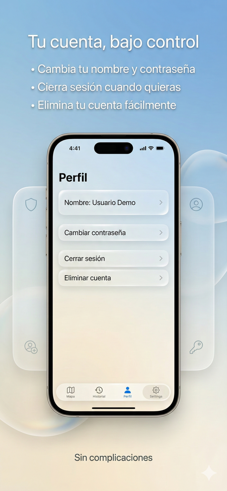
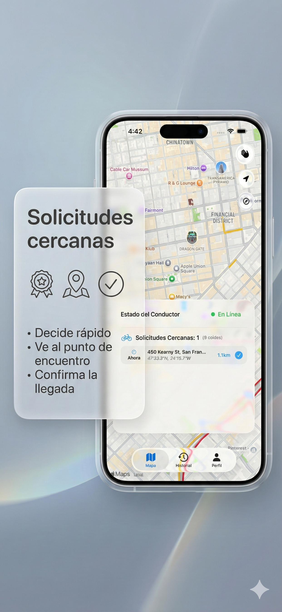
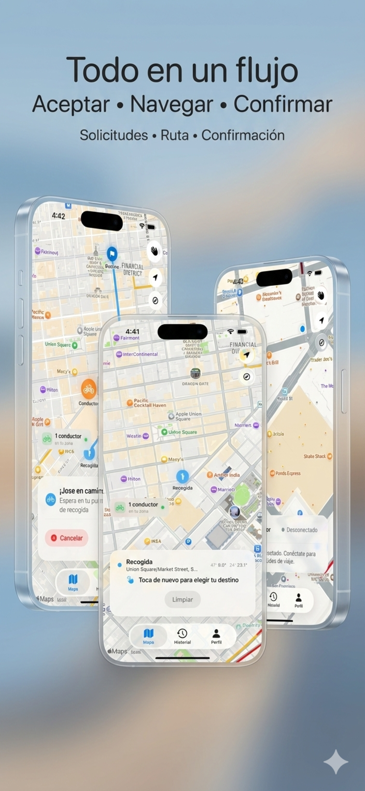

<div align="center">

<!-- Logo Principal -->


# 🚲 Bici Taxi

### *Ride-hailing reinvented for bike taxis*

[](/)
[](https://flutter.dev)
[](https://developer.apple.com/xcode/swiftui/)
[](https://firebase.google.com)
[](/)

<br>

<p>
  <strong>🌐 Hybrid Architecture</strong> · 
  <strong>🎨 Liquid Glass Design</strong> · 
  <strong>⚡ Real-time Matching</strong>
</p>

---

</div>

## 📱 App Previews

<div align="center">

### 🤖 Android (Flutter)

<table>
  <tr>
    <th colspan="5">🧑‍💼 Client App</th>
  </tr>
  <tr>
    <td align="center"></td>
    <td align="center"></td>
    <td align="center"></td>
    <td align="center"></td>
    <td align="center"></td>
  </tr>
  <tr>
    <th colspan="5">🚴 Driver App</th>
  </tr>
  <tr>
    <td align="center"></td>
    <td align="center"></td>
    <td align="center"></td>
    <td align="center"></td>
    <td align="center"></td>
  </tr>
</table>

<br>

### 🍎 iOS (Native SwiftUI)

<table>
  <tr>
    <th colspan="5">🧑‍💼 Client App</th>
  </tr>
  <tr>
    <td align="center"></td>
    <td align="center"></td>
    <td align="center"></td>
    <td align="center"></td>
    <td align="center"></td>
  </tr>
  <tr>
    <th colspan="5">🚴 Driver App</th>
  </tr>
  <tr>
    <td align="center"></td>
    <td align="center"></td>
    <td align="center"></td>
    <td align="center"></td>
    <td align="center"></td>
  </tr>
</table>

</div>

---

## 🏛️ Architecture

This monorepo follows a **Hybrid Architecture** leveraging the best of both worlds:

| | Android | iOS |
|:---:|:---:|:---:|
| **Tech Stack** |  |  |
| **Why?** | Rapid dev & ecosystem consistency | Native performance & Apple HIG |
| **Client App** | `flutter/bicitaxi` | `ios/bicitaxi` |
| **Driver App** | `flutter/bicitaxi_conductor` | `ios/bicitaxi-conductor` |

<details>
<summary><b>🔥 Why Hybrid?</b></summary>

<br>

- **Android (Flutter)**: Over 24,000 device models means Flutter's "write once" approach saves countless hours of QA and fragmentation headaches.
  
- **iOS (Native SwiftUI)**: Apple users expect buttery-smooth 120Hz animations, deep system integrations, and pixel-perfect adherence to Human Interface Guidelines. Native delivers.

- **Shared Backend**: Both platforms connect to the same Firebase backend, ensuring data consistency and real-time sync.

</details>

---

## ✨ Design System: Liquid Glass

<div align="center">

> *"A bright, clean aesthetic where content floats on translucent glass panels"*

</div>

Both platforms implement our custom **Liquid Glass** design language:

| Feature | Description |
|:---|:---|
| 🌅 **Light Mode Only** | Bright whites, soft grays, high contrast text |
| 🪟 **Glassmorphism** | `BackdropFilter` (Flutter) / `UltraThinMaterial` (SwiftUI) |
| 🔮 **GLSL Shader** | Real-time refraction with Fresnel edge glow |
| ✍️ **Typography** | Modern, bold headings (`SF Pro`, `Roboto`) |
| 🎬 **Animations** | Fluid 60fps transitions & micro-interactions |

<details>
<summary><b>📖 Shader Implementation Details</b></summary>

<br>

The Flutter version uses a custom GLSL fragment shader that creates:

- **Real-time refraction and distortion** of the map background
- **Subtle wave animations** for an organic feel  
- **Fresnel edge glow** (brighter at edges like real glass)
- **Dynamic widget position detection** for responsive effects

📄 Full guide: [`flutter/bicitaxi/LIQUID_GLASS.md`](flutter/bicitaxi/LIQUID_GLASS.md)

</details>

---

## 🎯 Core Features

<table>
  <tr>
    <td width="50%">
      <h3>🧑‍💼 Client (Rider)</h3>
      <ul>
        <li>🔐 Authentication (Email, Google)</li>
        <li>🗺️ Interactive map with real-time drivers</li>
        <li>📍 Select pickup & dropoff locations</li>
        <li>🚗 Request rides & track status</li>
        <li>👤 Profile management</li>
      </ul>
    </td>
    <td width="50%">
      <h3>🚴 Driver (Conductor)</h3>
      <ul>
        <li>🔐 Secure driver authentication</li>
        <li>📡 Real-time presence broadcasting</li>
        <li>🔔 Incoming ride notifications</li>
        <li>✅ Accept/Reject requests</li>
        <li>🧭 Turn-by-turn navigation</li>
      </ul>
    </td>
  </tr>
</table>

---

## 🛠️ Tech Stack

<div align="center">

```
┌─────────────────────────────────────────────────────────────┐
│                        FRONTEND                             │
├─────────────────────────┬───────────────────────────────────┤
│        ANDROID          │              iOS                  │
│  ┌───────────────────┐  │  ┌───────────────────────────┐   │
│  │  Flutter 3.27+    │  │  │  SwiftUI + Combine        │   │
│  │  Provider/Bloc    │  │  │  MVVM Architecture        │   │
│  │  flutter_map      │  │  │  MapKit                   │   │
│  │  liquid_glass_ui  │  │  │  Custom Glass Modifiers   │   │
│  └───────────────────┘  │  └───────────────────────────┘   │
├─────────────────────────┴───────────────────────────────────┤
│                        BACKEND                              │
│  ┌───────────────────────────────────────────────────────┐  │
│  │  🔥 Firebase                                          │  │
│  │     ├── Auth (Email/Google)                           │  │
│  │     ├── Cloud Firestore (Real-time DB)                │  │
│  │     ├── Cloud Functions (Serverless)                  │  │
│  │     └── Hosting (Account deletion page)               │  │
│  └───────────────────────────────────────────────────────┘  │
└─────────────────────────────────────────────────────────────┘
```

</div>

### Dependencies

<details>
<summary><b>🤖 Android (Flutter)</b></summary>

```yaml
dependencies:
  firebase_auth: ^5.x
  cloud_firestore: ^5.x
  google_sign_in: ^6.x
  flutter_map: ^7.x
  geolocator: ^13.x
  provider: ^6.x
```

</details>

<details>
<summary><b>🍎 iOS (Native)</b></summary>

```swift
// Swift Package Manager
dependencies: [
    .package(url: "firebase-ios-sdk", from: "11.0.0"),
]

// Frameworks
import SwiftUI
import MapKit
import Combine
```

</details>

---

## 🚀 Getting Started

### Prerequisites

| Tool | Version | Purpose |
|:---|:---|:---|
| Flutter SDK | 3.27+ | Android development |
| Xcode | 16+ | iOS development |
| CocoaPods | Latest | iOS dependencies |
| Firebase CLI | Latest | Backend deployment |

### Firebase Setup

1. Create a Firebase project at [console.firebase.google.com](https://console.firebase.google.com)
2. Enable **Authentication** (Email/Password + Google)
3. Create **Firestore Database**
4. Download config files:
   - `google-services.json` → `flutter/bicitaxi/android/app/`
   - `GoogleService-Info.plist` → iOS project roots

### 🤖 Running Android

```bash
# Client App
cd flutter/bicitaxi
flutter pub get && flutter run

# Driver App  
cd flutter/bicitaxi_conductor
flutter pub get && flutter run
```

### 🍎 Running iOS

```bash
# Open in Xcode
open ios/bicitaxi/bicitaxi.xcodeproj      # Client
open ios/bicitaxi-conductor/bicitaxi-conductor.xcodeproj  # Driver

# Then: Select device → Cmd+R
```

---

## 📂 Project Structure

```
bicitaxi/
│
├── 📁 flutter/                      # ANDROID APPS
│   ├── 📱 bicitaxi/                 # 🟢 Client App
│   │   ├── lib/
│   │   │   ├── features/            # Auth, Profile, Rides, Map
│   │   │   ├── core/                # Theme, Repos, Widgets
│   │   │   └── services/            # Firebase, Location
│   │   └── LIQUID_GLASS.md          # Shader documentation
│   │
│   └── 📱 bicitaxi_conductor/       # 🔵 Driver App
│       └── lib/
│           ├── features/            # Driver-specific flows
│           └── services/            # Presence, Requests
│
├── 📁 ios/                          # iOS APPS (Native SwiftUI)
│   ├── 📱 bicitaxi/                 # 🟢 Client App
│   │   ├── App/                     # Entry point
│   │   ├── Core/                    # Glass modifiers, Theme
│   │   └── Features/                # Auth, Map, Rides
│   │
│   └── 📱 bicitaxi-conductor/       # 🔵 Driver App
│       └── ...
│
├── 📁 media/                        # Store assets & videos
│   ├── android/                     # Play Store screenshots
│   └── ios/                         # App Store screenshots
│
├── 📁 public/                       # Firebase Hosting
│   └── delete-account.html          # Account deletion page
│
├── 📄 firestore.rules               # Security rules
├── 📄 firestore.indexes.json        # Composite indexes
└── 📄 README.md                     # You are here! 👋
```

---

## 🔐 Security & Privacy

- 🔒 **Firestore Security Rules**: Role-based access control
- 🔐 **Authentication**: Secure Firebase Auth with Google OAuth
- 📍 **Location**: Only shared while actively using the app
- 🗑️ **GDPR Compliance**: Account deletion available via web portal

📄 [Privacy Policy](PRIVACY_POLICY.md)

---

## 📝 Roadmap

- [x] Core authentication flow
- [x] Real-time map with driver presence  
- [x] Ride request & matching system
- [x] Geo-Cell optimization for scalability
- [ ] 💬 In-app chat (Firestore subcollections)
- [ ] 🔔 Push notifications (FCM)
- [ ] ⭐ Rating system
- [ ] 💳 Payment integration

---

## 📸 Store Banners

<div align="center">

### Android (Google Play)


</div>

---

<div align="center">

## 📄 Additional Documentation

| Document | Description |
|:---|:---|
| [🌊 Liquid Glass Guide](flutter/bicitaxi/LIQUID_GLASS.md) | Shader implementation details |
| [🌐 Geo Cells System](GEO_CELLS_README.md) | Location-based matching architecture |
| [🔒 Privacy Policy](PRIVACY_POLICY.md) | Data handling & user rights |

---

<br>

**Made with ❤️ by the Bici Taxi Team**

<sub>© 2024 Bici Taxi. All rights reserved.</sub>

</div>
